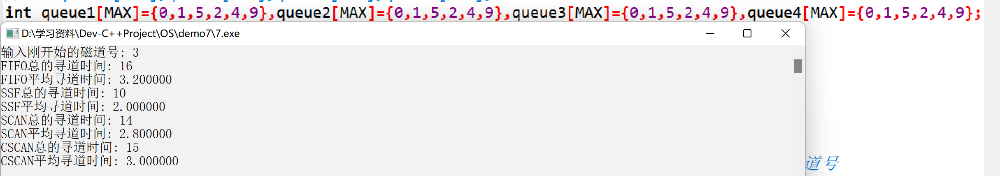

# 实验七、磁盘调度算法的模拟与实现

## 1、实验题目

磁盘调度算法的模拟与实现

## 2、实验目的

(1) 了解磁盘结构以及磁盘上数据的组织方式。
(2) 掌握磁盘访问时间的计算方式。
(3) 掌握常用磁盘调度算法及其相关特性。

## 3、背景知识

（1）磁盘数据的组织
磁盘上每一条物理记录都有唯一的地址，该地址包括三个部分：磁头号（盘面号）、**柱面号（磁
道号）**和扇区号。给定这三个量就可以唯一地确定一个地址。
（2）磁盘访问时间的计算方式
磁盘在工作时以恒定的速率旋转。为保证读或写，磁头必须移动到所要求的磁道上，当所要求
的扇区的开始位置旋转到磁头下时，开始读或写数据。对磁盘的访问时间包括：**寻道时间**、旋转延
迟时间和传输时间。
（3）磁盘调度算法
磁盘调度的目的是要尽可能降低磁盘的寻道时间，以提高磁盘 I/O 系统的性能。

* 先进先出算法：按访问请求到达的先后次序进行调度。
* 最短服务时间优先算法：优先选择使磁头臂从当前位置开始移动最少的磁盘 I/O 请求进行调度。
* SCAN（电梯算法）：要求磁头臂先沿一个方向移动，并在途中满足所有未完成的请求，直到它
到达这个方向上的最后一个磁道，或者在这个方向上没有别的请求为止，后一种改进有时候称作
LOOK 策略。然后倒转服务方向，沿相反方向扫描，同样按顺序完成所有请求。
* C-SCAN（循环扫描）算法：在磁盘调度时，把扫描限定在一个方向，当沿某个方向访问到最
后一个磁道时，磁头臂返回到磁盘的另一端，并再次开始扫描。

## 4、模块设计

本实验主要分为俩个模块，第一个模块主要是大量随机数的生成，第二个模块则是实现各类磁盘调度算法，先进先出算法、最短服务时间优先算法、SCAN（电梯算法）和C-SCAN（循环扫描）算法。

## 5、详细设计

### 5.1、数据结构

```c
#define MAX 1001//定义磁盘请求数最大值为MAX-1
int queue1[MAX],queue2[MAX],queue3[MAX],queue4[MAX];//存放磁盘请求的磁道号队列
int HEAD;//磁道号的初始位置
```
随机种子的生成
```c
srand(time(0)); 	//初始化种子
rand()%100;			//磁道号的范围为0~99之间
```
主要函数说明:
```c
void FIFO();		//先进先出算法
void SSF();			//最短服务时间优先算法
void SCAN(); 		//SCAN(电梯算法)
void CSCAN(); 		//C-SCAN(循环扫描)算法
```
### 5.2、流程图


### 5.3、算法思路

#### 5.3.1 、先进先出算法

1. 从磁盘队列中依次取出下一步要访问的磁道
2. 记录磁道移动的距离
```c
//seek寻道总时间，diff磁道偏移量，head当前所处磁道号 
for (i = 1; i <= n; i++)
    {
        diff = abs(head - queue1[i]);
        seek += diff;
        head = queue1[i];
    }
```
3. 序列中是否还存在未被访问的磁道,如果存在则转到步骤1执行,否则转到步骤4执行
4. 输出移动的总磁道距离

#### 5.3.1 、最短服务时间优先算法

1. 在磁道中找出未被访问的,且距离当前磁道最短的磁道queue2[pos]
2. 记录磁道移动的距离
```c
diff = abs(head - queue2[pos]);		//pos为最小的磁盘号所在的位置
seek += diff;
```
3. 更新当前磁道号位置
```c
head = queue2[pos];					//更新当前磁道号位置
queue2[pos] = queue2[tail];			//将移除的磁道号用最末尾的代替，tail--
tail--;								//tail为当前磁道请求队列中最后一个请求所在的位置
```
4. 序列中是否还存在未被访问的磁道,如果存在则转到步骤1执行,否则转到步骤5执行
5. 输出移动的总磁道距离

#### 5.3.1 、SCAN（电梯算法）

1. 初始化磁头移动的位置
2. 在磁道中找出未被访问的,跟磁头方向移动一致的且距离当前磁道最短的磁道queue3[pos]
```c
for (j = 1; j <= tail; j++){
if(queue3[j] >= head && abs(queue3[j] - head) < diff)	//找到离当前磁道号最近的位置
{
diff = abs(queue3[j] - head);
pos = j;
}
}
```
3. 能否在磁道序列中找出这样的磁道,如果不能则执行以下代码调转磁头反向转到步骤4执行,否则直接转到步骤4执行
```c
//当前磁道号最大，处在最右边的情况 
if (pos == -1)
{
int max=queue3[1];
pos=1;
for(int k=2;k<=tail;k++){				//寻找最大的磁盘号
if(queue3[k] >max){
pos=k;
max=queue3[k];
	}
  }     
}
```
4. 记录磁道移动的距离
```c
diff = abs(head - queue3[pos]);		
seek += diff;
```
5.  更新当前磁道号位置
```c
head = queue3[pos];					//更新磁道号位置
queue3[pos] = queue3[tail];			//将移除的磁道号用最末尾的代替，tail--
tail--;								//tail为当前磁道请求队列中最后一个请求所在的位置
```
6. 序列中是否还存在未被访问的磁道,如果存在则转到步骤2执行,否则转到步骤7执行
7. 输出移动的总磁道距离

#### 5.3.1 、C-SCAN（循环扫描）算法

1. 初始化磁头移动的位置
2. 在磁道中找出未被访问的,跟磁头方向移动一致的且距离当前磁道最短的磁道queue4[pos]
```c
for (j = 1; j <= tail; j++){
if (queue4[j] >= head && abs(queue4[j] - head) < diff)
{
diff = abs(queue4[j] - head);
pos = j;
}
}
```
3. 能否在磁道序列中找出这样的磁道,如果不能则执行以下代码将磁头回到初始方向的最左边且方向不变转到步骤4执行,否则直接转到步骤4执行
```c
//当前磁道号最大，处在最右边的情况
if (pos == -1)
{
int min=queue4[1];
pos=1;
for(int k=2;k<=tail;k++){				//寻找最小的磁盘号
if(queue4[k]<min){
pos=k;
min=queue4[k];
	  }
   }
}
```
4. 记录磁道移动的距离
```c
diff = abs(head - queue4[pos]);		
seek += diff;
```
5.  更新当前磁道号位置
```c
head = queue4[pos];					//更新磁道号位置
queue4[pos] = queue4[tail];			//将移除的磁道号用最末尾的代替，tail--
tail--;								//tail为当前磁道请求队列中最后一个请求所在的位置
```
6. 序列中是否还存在未被访问的磁道,如果存在则转到步骤2执行,否则转到步骤7执行
7. 输出移动的总磁道距离

## 6、实验结果与分析

首先测试算法的正确性，测试俩组数据结果如下：

* 

* 

明显可以看出结果的正确性，接下来计算大批数据的测试，得出一般规律：


可以看出当磁盘请求很多时，磁盘调度的效率高低依次是最短服务时间优先、SCAN算法、CSCAN算法、先进先出算法，且CSCAN算法的平均寻道时间稳定在0.197。

## 7、小结与心得体会

平时我们用的最多的就是文件操作，那么文件是存取磁盘的哪个位置呢，如何读取文件呢，通过这次实验我对磁盘的组成有了一定的了解，知道了从三个参数磁头号、柱面号、扇区号就可以唯一确定一个地址以及彻底理解了磁盘调度算法，知道什么样的情形下选用什么样的算法效率最高。