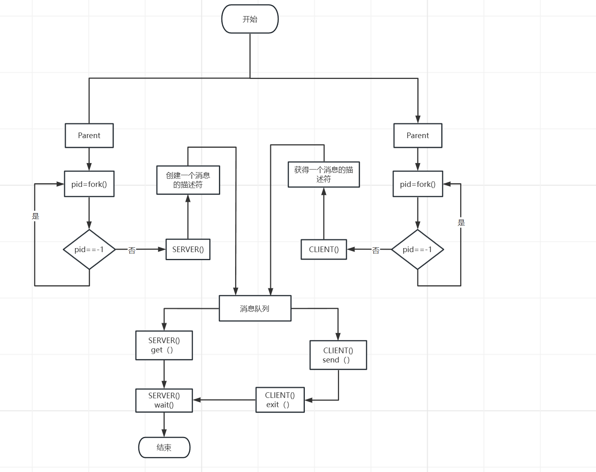

# 实验三、Linux 进程间通信

## 1、实验题目

Linux 进程间通信

## 2、实验目的

Linux 系统的进程通信机构（IPC）允许在任意进程间大批量地交换数据，通过本实验，理解
熟悉 Linux 支持的消息通信机制。

## 3、实验内容

流程图：

使用系统调用 msgget()，msgsnd()，msgrcv()及 msgctl()编制一长度为 1K 的消息的发送和接
收程序。

* 首先父进程fork()俩个子进程SERVER()和CLIENT()
* SERVER()通过系统调用msgget()去创建消息队列并得到消息描述符，然后再通过系统调用msgrcv()等待消息队列里面的消息，最后通过系统调用msgctl()去删除消息描述符
* CLIENT()通过系统调用msgget()去得到对应消息队列的标识符，然后再通过系统调用msgsnd()发送消息到消息队列当中

运行结果可以看出sent和recieved的打印次序并不是交替出现的，而是连续出现的，这是因为处理器通过时间片轮流执行进程，而执行相应的进程时，由于时间片还没到就会一直执行下去，因此我在打印后面加了一句代码`sleep(1)`，当打印完之后该进程就会去休眠，因此就能实现交替。

## 4、心得与体会

通过本此实验熟悉了对Linux终端下命令的使用和加深了对进程的创建的理解，了解了Linux下进程之间的通信过程以及如何进行进程通信，通过使用系统调用 msgget()，msgsnd()，msgrcv()及 msgctl()来实现进程通信资源的分配。

