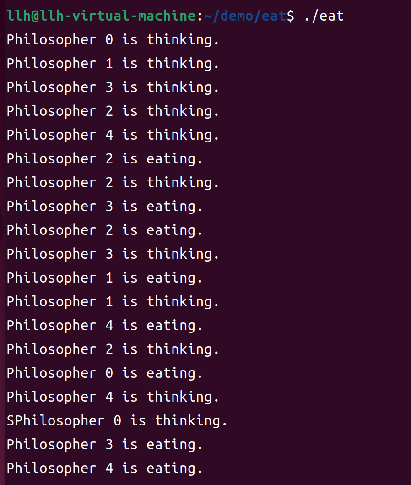

# 实验九、基于信号量机制的并发程序设计

## 1、实验题目

基于信号量机制的并发程序设计

## 2、实验目的

(1) 回顾操作系统进程、线程的有关概念，针对经典的同步、互斥、死锁与饥饿问题进行并发程序设计。
(2) 了解互斥体对象，利用互斥与同步操作编写读者-写者问题的并发程序，加深对 P (即semWait)、V(即 semSignal)原语以及利用 P、V 原语进行进程间同步与互斥操作的理解。
(3) 理解 Linux 支持的信息量机制，利用 IPC 的信号量系统调用编程实现哲学家进餐问题。

## 3、背景知识

* UINX/Linux 系统把信号量、消息队列和共享资源统称为进程间通信资源(IPC resource)。
* 提供给用户的 IPC 资源是通过一组系统调用实现的。使用 IPC 中提供的 semget（），semop（），及 semctl（）等信号量系统调用。

## 4、模块设计

主要分为俩大模块，第一个模块主要是定义和初始化信号量，找到其中蕴含的同步和互斥关系；第二个模块主要实现哲学家就餐的逻辑部分，使其不会发生死锁。


## 5、详细设计

### 5.1、数据结构

哲学家的数量以及左右筷子的编号
```c
#define N 5 // 哲学家数量
#define LEFT (i + N - 1) % N // 左邻居编号
#define RIGHT (i + 1) % N // 右邻居编号
```
主要定义了五个信号量分别代表哲学家，和一个互斥信号量。
```c
sem_t mutex; // 互斥信号量
sem_t s[N]; // 哲学家信号量
```
初始化信号量，由于哲学家初始状态都没有拿筷子，因此都为1，都可以去拿筷子
```c
sem_init(&mutex, 0, 1); // 初始化互斥信号量
    for (i = 0; i < N; i++) {
        sem_init(&s[i], 0, 1); // 初始化哲学家信号量
    }
```
### 5.2、流程图


### 5.3、算法思路

1. 哲学家按0到4编号,编号为i的哲学家左边的筷子left为i ，右边的筷子right为(i+1)%5
2. 定义互斥量数组S[5]和一个互斥量mutex
3. 伪代码
```c
semaphore S[5]={1,1,1,1,1}
semaphore mutex=1
pi:
while(1){
P(mutex)
P(left)		//拿左筷子
P(right)	//拿右筷子
V(mutex)
//吃饭.....
V(left)		//放左筷子
V(right)	//放右筷子
//思考.....
}
```
根据上述伪代码实现即可

## 6、实验结果与分析

运行结果如下：



可以看出运行一段时间后不会发生死锁，唯一的缺点就是如果调度太频繁的话，容易引起某位哲学家饥饿。

## 7、小结与心得体会

通过这次实验，我进一步的了解了Linux下如何使用信号量来解决同步互斥问题，多个进程并发进行如何去预防死锁，去避免死锁，只需要打破死锁的充分必要条件之一即可实现，死锁的充分必要条件分别是互斥，占有且等待、不可抢占、循环等待。
