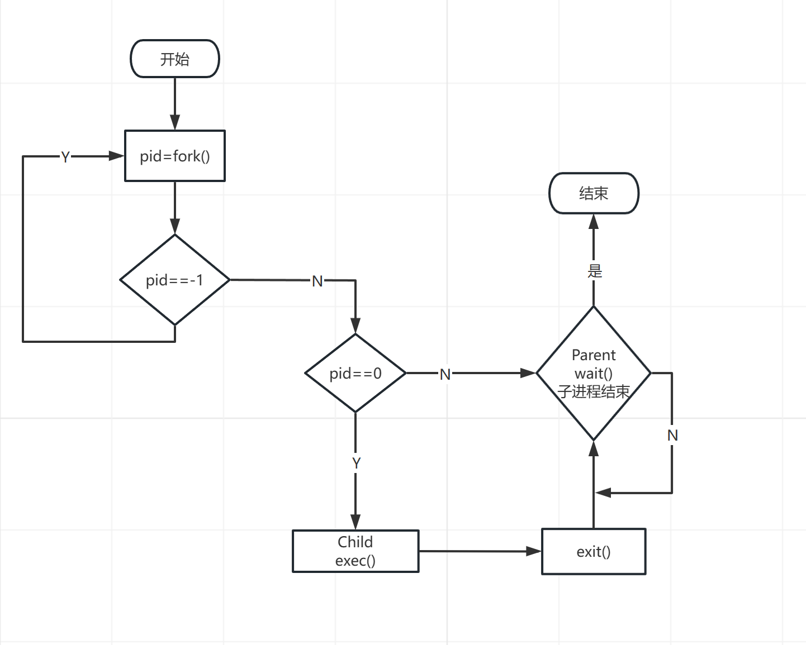

# 实验二、Linux 进程控制

## 1、实验题目

Linux 进程控制

## 2、实验目的

通过进程的创建、撤销和运行加深对进程概念和进程并发执行的理解，明确进程和程序之间的
区别。

## 3、实验内容

流程图：



在 Linux 中创建子进程要使用 fork()函数，执行新的命令要使用 exec()系列函数，等待子进程结
束使用 wait()函数，结束终止进程使用 exit()函数。

### 3-1、进程的创建

运行结果如下

通过fork()创建子进程，父进程打印出b，子进程打印a，最后各自都打印c。
结果可以看出由于sleep的原因以及调度方法导致打印结果的顺序是不一样的。

```c
sleep(rand() % 3);
```
### 3-2、子进程执行新任务

运行结果如下


可以看出执行程序后，首先父进程fork()创建子进程，由于执行完fork()函数后父进程返回的值是大于0，而子进程返回的值为0，让子进程使用exec系列的函数去执行`ls`命令，而父进程则等待子进程而阻塞，直到子进程的结束，最后打印出子进程结束的字符串。

## 4、心得与体会

通过这次实验又熟悉了Linux环境的搭建以及编译命令和vim的使用，大致了解了Linux下如何创建进程以及创建进程的过程，如何通过exec系列的函数执行相应的程序。