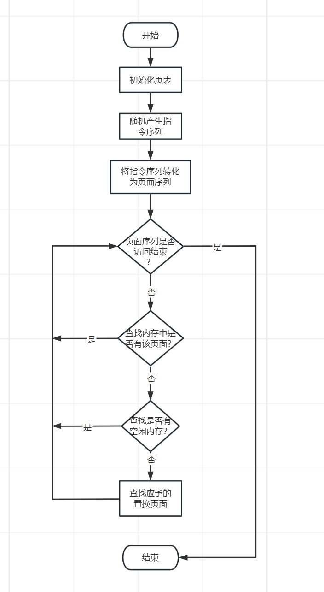
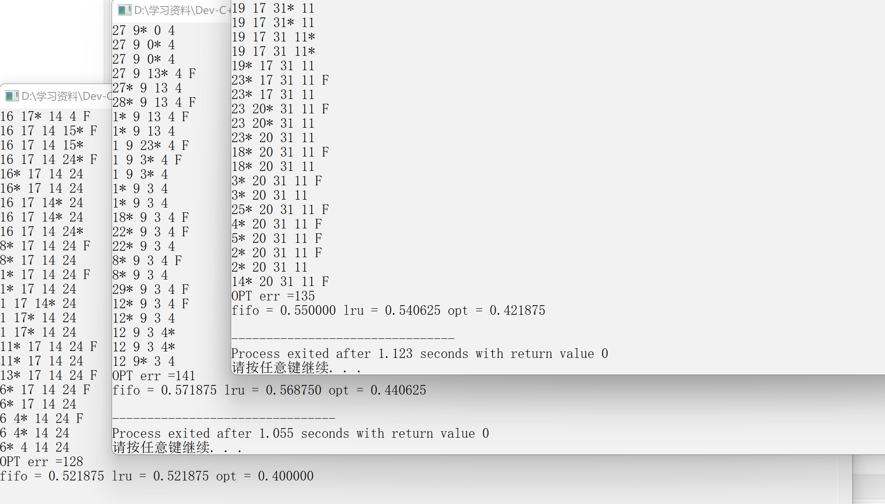

# 实验八、虚拟内存系统的页面置换算法模拟

## 1、实验题目

虚拟内存系统的页面置换算法模拟

## 2、实验目的

通过对页面、页表、地址转换和页面置换过程的模拟，加深对虚拟页式内存管理系统的页面置换原理和实现过程的理解。

## 3、背景知识

1. 需要调入新页面时，选择内存中哪个物理页面被置换，称为置换策略。
2. 页面置换算法的目标： 把未来不再使用的或短期内较少使用的页面调出，通常应在局部性原理指导下依据过去的统计数据进行预测，减少缺页次数。
3. 常用的页面置换算法包括：
* 最佳置换算法(OPT)：置换时淘汰“未来不再使用的”或“在离当前最远位置上出现的”页面。
* 先进先出置换算法(FIFO)：置换时淘汰最先进入内存的页面，即选择驻留在内存时间最长的
页面被置换。
* 最近最久未用置换算法(LRU)：置换时淘汰最近一段时间最久没有使用的页面，即选择上次
使用距当前最远的页面淘汰。
* 时钟算法(Clock)：也称最近未使用算法(NRU, Not Recently Used)，它是 LRU 和 FIFO 的折
中。

## 4、模块设计

本次设计一共包括俩大部分，第一大部分就是要设计出一个体现局部性原理的随机数列，然后将它当作指令序列；第二大部分则是要模拟实现OPT，FIFO，LRU算法。

## 5、详细设计

### 5.1、数据结构

页框的数据结构：
```c
struct MemoryCell
{
    int index;		//页号
    int time;		//记录页面使用的时间
};
```
OPT算法和FIFO算法的实现只需知道页号是多少即可，而LRU算法的实现则需知道上次使用距离当前的时间，因此增加的一个时间变量来记录。
相关的宏定义：
```c
#define MEM_PAHE_NUM 4				//最大的内存页面数
#define COMMD_NUM 320				//指令序列的数量
#define PAGE_COMMD 10				//一个页面所含有的指令数
#define MAX_FAR 1000000000
```
相关的全局变量：
```c
int commds[COMMD_NUM];    		  	//存放的是每一条指令的页号
MemoryCell memory[MEM_PAHE_NUM];  	//内存块
vector<int> order_commd;			//指令序列 
vector<int> order_page;				//指令序列对应的指令页号 
```
函数说明：
```c
void initPage();    //初始化页表
void createArray(); //生成序列
double FIFO();      //用FIFO置换算法
double LRU();       //用LRU置换算法
double OPT();       //用OPT置换算法
```
### 5.2、流程图



### 5.3、算法思路

#### 5.3.1、指令序列的设计

① 在[0, 319]的指令地址之间随机选取一起点 m；
② 顺序执行一条指令，即执行地址为 m+1 的指令；
③ 在前地址[0, m+1]中随机选取一条指令并执行，该指令的地址为 m1;
④ 顺序执行一条指令，其地址为 m1+1;
⑤ 在后地址[m1+2, 319]中随机选取一条指令并执行；
⑥ 重复上述步骤①~⑤，直到执行 320 条指令。

1. 根据上述规则，实现其代码，逻辑很简单，需要注意的是m=319的特殊情况。

```c
if(m == COMMD_NUM-1)
continue;					//m=319  
```
2. 将指令序列转为页面序列
```c
//将指令序列转化为页号序列
for(int i=0;i<order_commd.size();i++)
{
order_page.push_back(commds[order_commd[i]]);
}
```
3. 缺页时，内存页面有空闲则执行下面关键代码
```c
if(memory_page_num < MEM_PAHE_NUM)
{
memory[memory_page_num++].index = order_page[i];
}
```
4. 缺页时，内存页面没有空闲则需要执行置换算法
```c
for(int j=1;j<memory_page_num;j++)
{
memory[j-1] = memory[j];	//将第一个置换出去
}
memory[memory_page_num-1].index=order_page[i];
```
FIFO：将内存中的第一个页面置换出去，后面的往前移动，末尾添加新的页面。
```c
for(int j=0;j<memory_page_num;j++)
{
if(memory[minn].time > memory[j].time)
{
minn = j;
}
}
memory[minn].time = i;				//更新时间戳
memory[minn].index = order_page[i];
```
LRU：寻找历史页面距离当前内存中的页面的最近距离，更新时间戳。
```c
for(int j=0;j<memory_page_num;j++)
{
for(int k=i+1;k<order_page.size();k++)
{
if(memory[j].index == order_page[k]){ //未来出现的位置
far[j] = k;
break; 
}
}
```
OPT：寻找未来页面距离当前内存页面最远的距离。

## 6、实验结果与分析

运行结果如下：



可以很明显的看出页面置换算法中效率最高的是OPT算法，其次是LRU，最后是FIFO，LRU和FIFO的效率差距不是很明显，虽然OPT算法的效率很高，但是对于未来页面的预测是很难实现的。

## 7、小结与心得体会

以前对于虚拟内存的页面是一个很模糊的概念，通过这次实验熟悉了虚拟内存面页面，更加了解了页面的置换算法，可以说收获多多，感觉自己的知识又得到更近一步的提高。