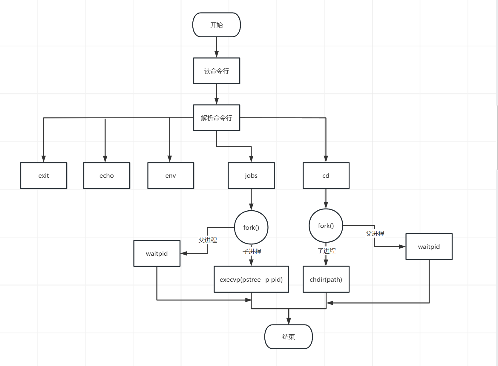

# 实验十、实现一个简单的 shell 命令行解释器

## 1、实验题目

实现一个简单的 shell 命令行解释器

## 2、实验目的

本实验主要目的在于进一步学会如何在 Linux 系统下使用进程相关的系统调用，了解 shell 工作的基本原理，自己动手为 Linux 操作系统设计一个命令接口。

## 3、背景知识

本实验要使用创建子进程的 fork()函数,执行新的命令的 exec（）系列函数，通常 shell 是等待子进程结束后再接受用户新的输入，这可以使用 waitpid()函数。

## 4、模块设计

主要分为俩个模块，第一个模块主要是完成Linux自带的一些命令，只需要执行exec命令即可完成，第二个模块则是需要深入底层，通过直接调用系统调用完成。

## 5、详细设计

### 5.1、数据结构

```c
#define MAX_CMD_LEN 1024	//最大命令长度
#define MAX_ARG_NUM 64 		//最大参数命令
```
函数说明：
打印标识符号
```c
void print_prompt()
```
根据输入的参数解析命令
```c
int read_command(char* cmd_buf,char ** arg_bufs,int max_arg_num)
```
通过调用封装好的系统命令，执行exec命令
```c
void execute_command(int arg_num,char ** args)
```
cd命令和jobs命令函数
```c
cd(char *path)
void jobs()
```
### 5.2、流程图



### 5.3、算法思路

命令解释器首先是一个无限循环。
1. 首先在main函数中，我们需要设置一个无限循环，不断让用户输入命令
2. 使用fgets函数进行标准输入操作
```c
fgets(cmd_buf,MAX_CMD_LEN,stdin);
```
3. 通过if-else结构进行解析命令字符串

```c
//解析命令的关键代码
char *token =strtok(cmd_buf," ");
token=strtok(NULL," ");
```
3. 判断若输入的是exit命令，则直接break跳出循环，表示退出shell
4. 若判断为echo和env，则直接使用Linux封装的库函数即可
5. 若为jobs则需要调用自定义函数，创建子进程来到达该目的
6. 若为cd则直接调用系统调用chdir(path)来实现

## 6、实验结果与分析


可以看出基本的功能都可以实现

## 7、小结与心得体会

通过这次实验，了解了命令解释器的基本工作原理，实现了一些基本命令的解释，对Linux有了更深的了解，不过还有好多命令没有实现，原来Linux的强大之处还有好多需要探索，激发了我对Linux的极大兴趣。