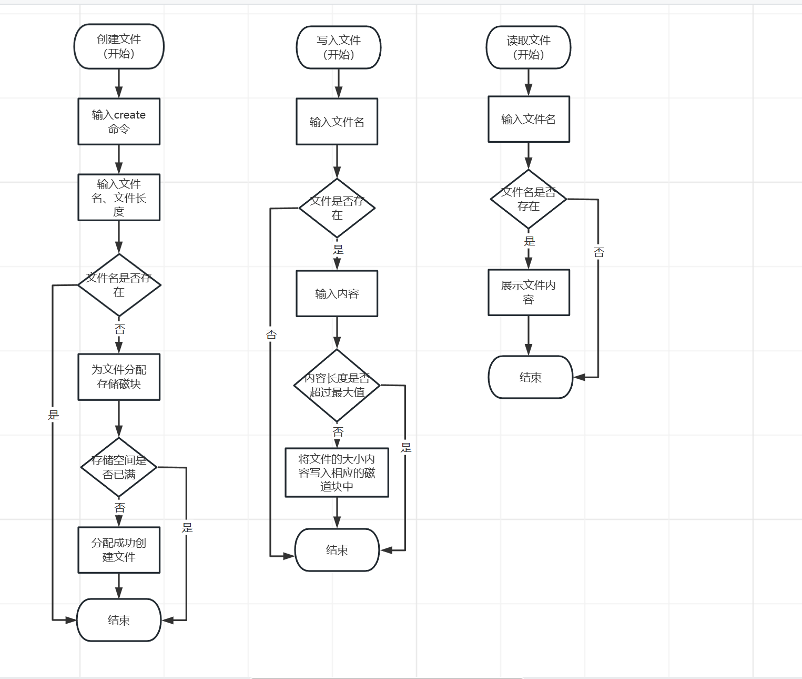

# 实验十一、简单二级文件系统设计

## 1、实验题目

简单二级文件系统设计

## 2、实验目的

让学生自己动手设计一个简单的文件系统，进一步巩固操作系统的文件系统的理论知识。

## 3、背景知识

为 Linux/Unix 设计一个简单的二级文件系统，要求做到以下几点：
（1）可以实现下列几条命令（至少 4 条）
	Login 用户登录
	Dir 列文件目录
	Create 创建文件
	Delete 删除文件
	Open 打开文件
	Close 关闭文件
	Read 读文件
	Write 写文件
（2）列目录时要列出文件名、物理地址、保护码和文件长度
（3）源文件可以进行读写保护

## 4、模块设计

主要分为三大模块，第一个模块为磁盘类的设计包含磁盘卷的结构和组织，第二个模块为文件类和目录类的设计，第三个模块则是文件系统的设计。


## 5、详细设计

### 5.1、数据结构

主要的数据结构
```c
const int BLOCK_SIZE = 512; // 磁盘块大小
const int BLOCK_NUM = 1024; // 磁盘块数量
const int MAX_FILE_NUM = 128; // 最大文件数量
const int MAX_FILE_NAME_LEN = 32; // 最大文件名长度
const int MAX_FILE_SIZE = 1024 * 1024; // 最大文件大小
```
磁盘类：管理磁盘操作，从磁盘块中读出数据，将数据写入磁盘块
```c++
class Disk {
  //从磁盘块读出数据
    void read(int block, char* buf)
  // 将数据写入磁盘块
    void write(int block, char* buf) 
private:
    char* data;       //定义整个磁盘卷
};
```
文件类：文件的一些基本属性得到文件的名称、文件所处的磁盘块、文件的大小
```c++
class File {

char* getName()			//得到文件名
int getBlock() 			//得到文件块
int getSize()      		//得到文件大小
void setSize(int size)  //设置文件大小
 private:
        char name[MAX_FILE_NAME_LEN];       //名称
        int block;                          //占用的磁盘块
        int size;                           //大小
    };
```
目录类：目录名称和所含的文件以及子目录项和父目录
```c++
class Directory {
private:
        char name[MAX_FILE_NAME_LEN];//名称
        Directory* parent;			 //父目录
        vector<File*> files;		 //含有的文件项
        vector<Directory*> dirs;	 //含有的目录项
};
```
文件系统类：对文件的一些基本操作，读写文件创建删除文件以及创建目录。
```c++
class FileSystem {
//文件系统的私有属性
    Disk* disk;
    int fat[BLOCK_NUM];	    //FAT表用于记录整个磁盘卷的使用情况
    File* files[BLOCK_NUM]; //存放文件系统的所有文件
    Directory* root;		//根目录
    Directory* current_dir;	//当前目录
};
```
### 5.2、流程图



### 5.3、算法思路

1. 读取命令行参数，解析命令使用getline函数
```c
cin.getline(cmd, 256);
char* p = strtok(cmd, " ");			//设置标记符
```
2. 初始化FAT表，FAT表用于记录整个磁盘卷的使用情况以及根目录让当前目录指向根目录
```c
 memset(fat, -1, sizeof(fat));     //初始化为-1，即整个磁盘卷都是空的
root = new Directory();	          //根目录
current_dir = root;	              //当前目录等于根目录
```
3. 若命令是create，则将文件名存到文件系统中，并在FAT表中寻找空闲的块，将其块标记为-2
```c
//查找空闲的磁盘块
    int findFreeBlock() {
        for (int i = 0; i < BLOCK_NUM; i++) {
            if (fat[i] == -1) {
                return i;
            }
        }
        return -1;
    }
```
4. 若命令为write，则先将磁盘中该文件的内容读出来，然后再将所有文件内容写入进去，如果文件内容大于一个块，则上一个块存取的编号则为下一个块的编号，最后一个存放-2表示文件的结束。
```c++
		//关键部分
        while (size > 0) {
            char buf[BLOCK_SIZE];
            disk->read(block, buf);
            int n = min(size, BLOCK_SIZE);
            memcpy(buf, data + offset, n);
            disk->write(block, buf);
            offset += n;							//更新偏移量
            size -= n;
            if (size > 0) {							//先取出来，在存到磁盘里面
                int next = findFreeBlock();
                if (next == -1) {
                    cout << "No free block" << endl;
                    return;
                }
                fat[block] = next;
                block = next;
                fat[block] = -2;
            }
        }
```
5. 若命令为read，找到文件所对应的磁盘块，将文件内容从磁盘块中读出即可读出
6. 若命令为mkdir，则将其目录的名称存于文件系统当中

## 6、实验结果与分析

没有实现其删除功能，还有许多功能需要完善和改进，存在许多不足，不过基本功能还是实现了。


## 7、小结与心得体会

这是最后一个实验也是最让人痛苦的一个实验，不过通过这个实验让我对操作系统有了更清晰的认识了，了解了磁盘的基本组织方式和结构，使得操作系统的脉络一下子就清晰起来了，收获非常多，收益良浅。
